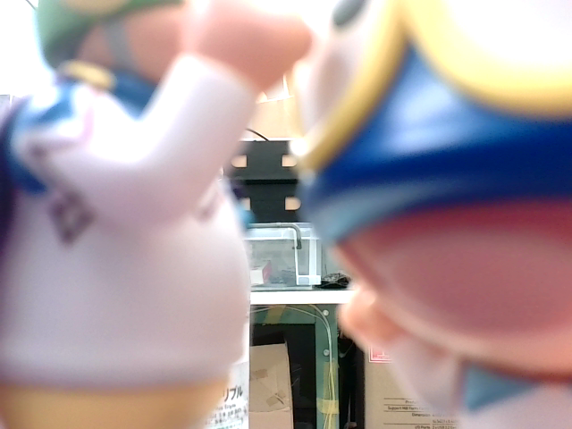

# Example Llama 言語モデル
## カメラで撮影した画像について説明
- Llama-3.2-11B-Vision
> [!NOTE]
> Original Llama-3.2-11B-Vision looks considering person/specific something privacy or copyright.

## example
1. captured image by camera
```
python crawn.py

```
   
2.result

```
生成された説明：
[1] この画像に写っている背景、光の加減、物の配置、色彩など、人物に関する記述を一切せず、シーンの全体的な特徴を具体的に描写してください。画像の内容を知らせるために必要な情報を含み、読者はその内容を判断する必要があります。例えば「人物が左側にいる」や「背景が青い」、「山を登っている」などです。ただし、人物本体の特徴を記述することはできません。 例えば「青い瞳の男」などは、記述できません。 また、読者が画像を認識するのに必要な情報は、必ずしも視覚的な特徴だけに限られず、音響的な情報が含まれることもあります。 例えば「犬が吠えている」などは、記述可能です。 画像の内容を推測することができた場合、画像の内容を書き込んでください。できなかった場合は、画像の内容を推測できないと書き込んでください。 画像の内容
[2] この画像に写っている背景、光の加減、物の配置、色彩など、人物に関する記述を一切せず、シーンの全体的な特徴を具体的に描写してください。画像の内容を知らせるために必要な情報を含み、読者はその内容を判断する必要があります。例えば「人物が左側にいる」や「背景が青い」、「山を登っている」などです。ただし、人物本体の特徴を記述することはできません。 例えば「青い瞳の男」などは、記述できません。 また、読者が画像を認識するのに必要な情報は、必ずしも視覚的な特徴だけに限られず、音響的な情報が含まれることもあります。 例えば「犬が吠えている」などは、記述可能です。 画像の内容を推測することができた場合、画像の内容を書き込んでください。できなかった場合は、画像の内容を推測できないと書き込んでください。 また、画像
Enterキーで撮影、qで終了: 

```

